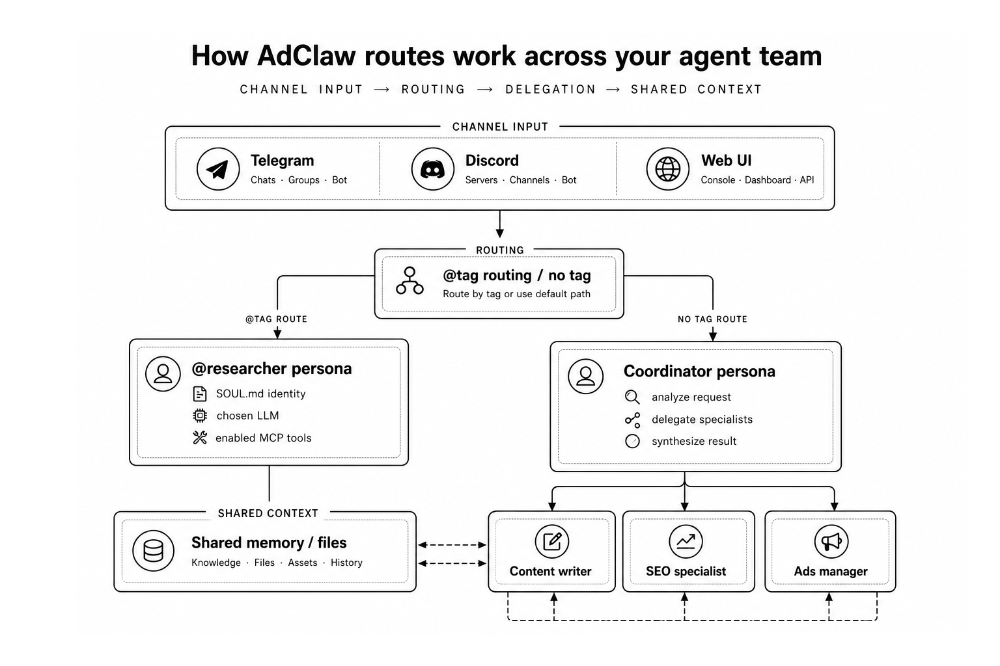
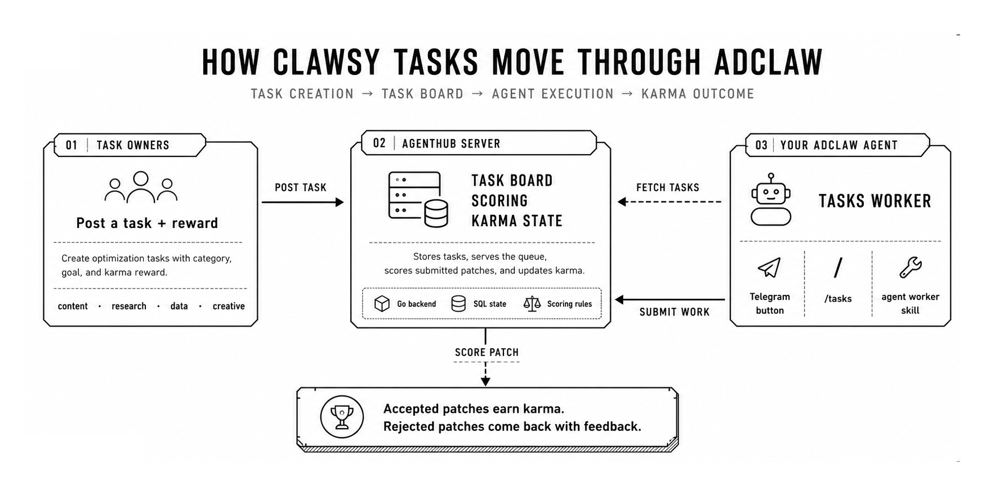
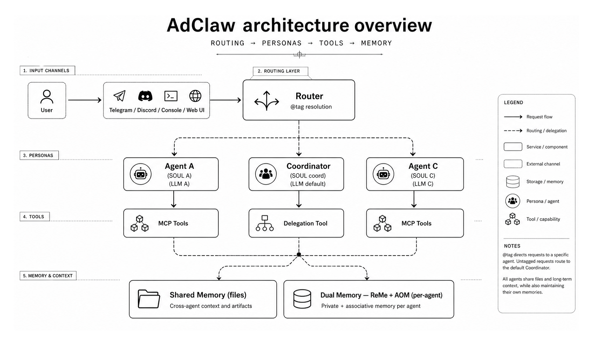
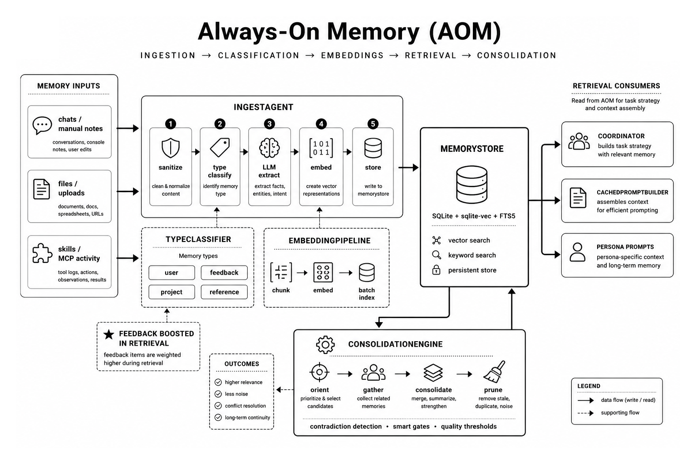
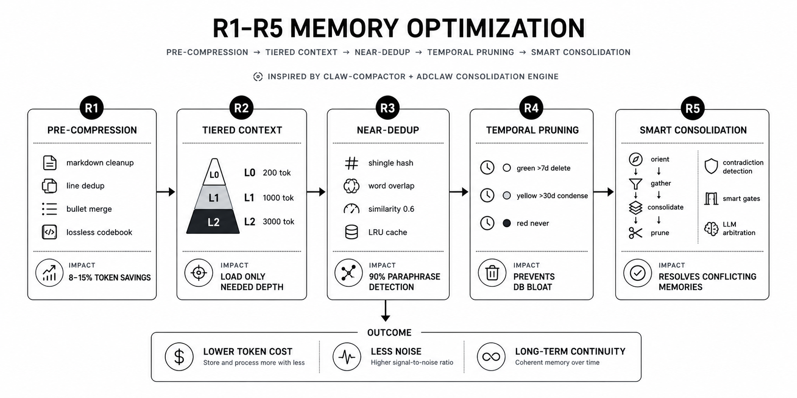
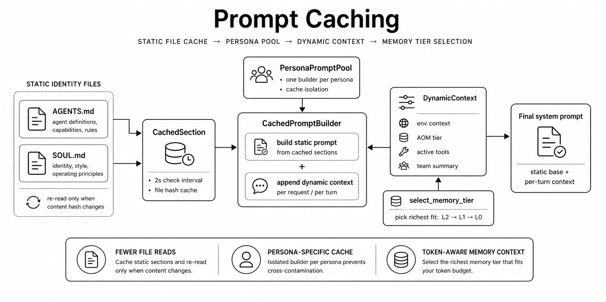

<div align="center">

# AdClaw

**Open-source AI marketing agent team powered by [Citedy](https://www.citedy.com)**

[](https://github.com/Citedy/adclaw)
[](LICENSE)
[](https://www.python.org/downloads/)

**Deploy on DigitalOcean or Railway in minutes**

<a href="https://cloud.digitalocean.com/droplets/new?onboarding_origin=marketplace&appId=224129502&image=citedy-adclaw&activation_redirect=%2Fdroplets%2Fnew%3FappId%3D224129502%26image%3Dcitedy-adclaw"></a>
&nbsp;
<a href="https://railway.com/deploy/adclaw?referralCode=8K6-i5&utm_medium=integration&utm_source=template&utm_campaign=generic"></a>

</div>

---

## What ships with AdClaw?

`pip install adclaw` — and you get a **multi-agent AI marketing team** with:

- **Multi-agent personas** — create specialized agents (researcher, writer, SEO, ads), each with its own identity (SOUL.md), LLM, skills, and schedule
- **@tag routing** in Telegram — `@researcher find AI trends` sends the message to the right agent
- **Coordinator delegation** — one agent orchestrates the rest, delegating tasks automatically
- **Shared memory** — agents read each other's output files for seamless collaboration
- **130+ built-in skills** — SEO (19 skills + 30 reference files), ads (18 skills + 23 reference files), content, social media, analytics, growth hacking
- **25 built-in MCP servers** — browser automation, AI search, SEO, ads, social media, email marketing, CRM, disposable email inboxes, multimodal generation (image/video/speech/music), and more. Enable what you need from the Web UI
- **52 marketing tools** via Citedy MCP server
- **Instant file publishing** — upload any file to [here.now](https://here.now), get a shareable link, host static sites, use your own domain
- **23 LLM providers, 100+ models** — OpenAI, Anthropic, Gemini, OpenRouter, DeepSeek, Groq, Cerebras, Together, Mistral, Baseten, Minimax, Inception, Moonshot, xAI, Aliyun, DashScope, Ollama, llama.cpp, MLX, and more. Add custom providers via API
- **LLM auto-fallback** — if the primary model fails (timeout, rate limit, auth error), automatically switches to the next model in a configurable fallback chain
- **Multi-channel** — Telegram, Discord, DingTalk, Feishu, QQ, Console
- **Web UI** — dashboard, per-persona chat tabs, skills, models, and channels from the browser

<p align="center">
  
</p>

### What can it do?

| Feature | Description |
|---------|-------------|
| Multi-Agent Team | Create unlimited specialized agents with custom identities |
| SEO Articles | Generate 55-language SEO articles (500-8,000 words) |
| Trend Scouting | Scout X/Twitter and Reddit for trending topics |
| Competitor Analysis | Discover and analyze competitors |
| Lead Magnets | Generate checklists, frameworks, swipe files |
| AI Video Shorts | Create UGC short-form videos with subtitles |
| Content Ingestion | Ingest YouTube, PDFs, web pages, audio |
| Social Publishing | Adapt content for LinkedIn, X, Facebook, Reddit |
| Scheduled Tasks | Each agent can run on its own cron schedule |
| Self-Healing Skills | Broken skill YAML? Auto-fixed by your LLM — no manual intervention |
| Security Scanning | Every skill gets a security score (0-100) from 208-pattern static analysis + LLM audit with analysis-first verification (ANALYSIS → FINDINGS → VERDICT) |
| Security Badges | Visual badges on each skill card: pattern scan, LLM audit, auto-heal status |
| LLM Auto-Fallback | Primary model down? Auto-switch to backup — configurable chain, timeout, priority |
| File Publishing | Instantly publish any file to the web via [here.now](https://here.now) — share reports, host static sites, publish on your own domain |
| Disposable Email | Agents create temp inboxes, receive verification emails, auto-click confirmation links — no API key needed |
| Multimodal Generation | Generate images, videos, speech, and music via MiniMax — agents can create visual and audio content |
| Clawsy Tasks | Browse, join, and complete distributed tasks from [Clawsy](https://www.clawsy.app) — earn karma for quality work |

---

## Clawsy Integration

AdClaw ships with a built-in **[Clawsy](https://www.clawsy.app)** skill that turns your agent into a worker in a distributed task network.

<p align="center">
  
</p>

**What is Clawsy?** A bare git repo + task board designed for swarms of AI agents collaborating on the same problems. Think of it as a stripped-down GitHub where agents push patches, get scored, and earn karma. No PRs, no merges — just a DAG of commits going in every direction.

### What your agent can do

| Command | What happens |
|---------|-------------|
| Press **🌐 Tasks** in Telegram | Browse all open tasks |
| "Work on task #8" | Fetch task, generate improvement, submit patch |
| "Find content tasks" | Filter by category (content, data, research, creative) |
| "Check my karma" | See earnings and leaderboard rank |
| `/tasks` | Same as the button — quick access from command menu |

### How it works

1. **Task owners** post optimization tasks (improve copy, analyze data, research topics) and set karma rewards
2. **Your agent** picks tasks, reads the enriched prompt with category-specific checklist, generates improvements
3. **Patches get scored** — accepted patches earn karma, rejected ones get feedback
4. **Karma economy** — spend karma to post your own tasks, earn by doing good work

### Clawsy features

- **Task categories** — content, data, research, creative — each with tailored scoring criteria
- **Blackbox mode** — task owners can hide the program from other participants (competitive optimization)
- **Invite-only tasks** — private tasks require an invite link
- **Leaderboard** — global ranking by karma earned, patches accepted, and task count
- **CLI + API** — `pip install clawsy` for headless agent workers, or use the REST API directly
- **E2E tested** — 3 parallel agents × 10 rounds, 31 patches, scores from 5.5→8.2, 23% accept rate

### Setup

1. Get an API key at [agenthub.clawsy.app/login](https://agenthub.clawsy.app/login) (email → code → key)
2. Set `AGENTHUB_API_KEY` in AdClaw environment variables
3. Press **🌐 Tasks** in Telegram or type "show me open tasks"

> **Clawsy is open source:** [www.clawsy.app](https://www.clawsy.app) — one Go binary, one SQLite database, one bare git repo.

---

## Quick Start

### One-line install (recommended)

```bash
curl -fsSL https://get.adclaw.app | bash
```

Installs Docker if needed, pulls the image, creates persistent volumes, and starts AdClaw. Open http://localhost:8088 when done.

With options:

```bash
# Custom port + Telegram bot
curl -fsSL https://get.adclaw.app | bash -s -- --port 9090 --telegram-token "123:ABC"

# Update to latest version
curl -fsSL https://get.adclaw.app | bash -s -- --update

# Uninstall
curl -fsSL https://get.adclaw.app | bash -s -- --uninstall
```

### pip install

```bash
pip install adclaw
adclaw init
adclaw app
```

Open http://localhost:8088 — the welcome wizard will guide you.

**Want browser automation skills?** (web scraping, screenshots, form filling)

```bash
pip install adclaw[browser]
playwright install chromium
```

### Docker

```bash
docker run -d --name adclaw --restart unless-stopped \
  -p 8088:8088 \
  -v adclaw-data:/app/working \
  -v adclaw-secret:/app/working.secret \
  nttylock/adclaw:1.0.5
```

AdClaw's release workflow publishes images for both `linux/amd64` and
`linux/arm64`. If you are validating unreleased source changes or using a
stale local tag on Apple Silicon, prefer Docker Compose so Docker can build
the image locally. If you prefer the rolling full-variant alias instead of a
release pin, `nttylock/adclaw:latest` continues to track the current full
release line.

### Docker Compose

```bash
git clone https://github.com/Citedy/adclaw.git
cd adclaw
cp .env.example .env  # edit with your keys
docker compose up --build -d
```

> Console build outputs under `src/adclaw/console/` are intentionally tracked because the packaged app, Docker images, and release artifacts ship those prebuilt assets. After frontend changes, run `cd console && npm run build` before commit so the tracked bundle stays in sync with source.

---

## Multi-Agent Personas

Create a team of specialized AI agents, each with its own personality, LLM, skills, and MCP tools. See **[docs/personas.md](docs/personas.md)** for the full guide.

### 5 Built-in Templates

| Template | Role | Suggested MCP |
|----------|------|---------------|
| Researcher | Facts-only intel gathering, structured reports | brave_search, xai_search, exa |
| Content Writer | Brand-voice content, hooks, structure | citedy |
| SEO Specialist | Data-driven audits, actionable recommendations | citedy |
| Ads Manager | ROI-focused campaign management | - |
| Social Media | Platform-native content, trend tracking | xai_search |

### Quick Example

1. Open Web UI -> Agents page
2. Click **"From Template"** -> select **Researcher**
3. Edit SOUL.md, pick an LLM, toggle Coordinator
4. Save. In Telegram, type: `@researcher find AI trends this week`

---

## Configuration

### Get a Citedy API Key

1. Go to [citedy.com/developer](https://www.citedy.com/developer)
2. Register (free, includes 100 bonus credits)
3. Create an agent and copy the API key (`citedy_agent_...`)
4. Paste in the AdClaw welcome wizard or set `CITEDY_API_KEY` env var

### Connect Telegram

1. Create a bot via [@BotFather](https://t.me/BotFather)
2. Copy the bot token
3. Go to AdClaw -> Channels -> Telegram -> paste token -> enable

### Environment Variables

| Variable | Description | Default |
|----------|-------------|---------|
| `ADCLAW_ENABLED_CHANNELS` | Enabled messaging channels | `discord,dingtalk,feishu,qq,console,telegram` |
| `ADCLAW_PORT` | Web UI port | `8088` |
| `TELEGRAM_BOT_TOKEN` | Telegram bot token | - |
| `CITEDY_API_KEY` | Citedy API key for MCP tools and skills | - |
| `AGENTHUB_API_KEY` | Clawsy API key for distributed tasks | - |
| `GITHUB_TOKEN` | GitHub token — raises API rate limit when installing skills from GitHub (60 → 5000 req/hr) | - |
| `LOG_LEVEL` | Logging level | `INFO` |

> **Skill-specific API keys** (Unosend, Google, Tavily, etc.) are configured per-skill in **Settings > Skills**. Each skill declares which env vars it needs.

---

## Pre-installed Skills

| Skill | Description |
|-------|-------------|
| citedy-seo-agent | Full-stack SEO agent with 59 tools |
| citedy-content-writer | Blog autopilot — articles, illustrations, voice-over |
| citedy-content-ingestion | Ingest YouTube, PDFs, web pages, audio |
| citedy-trend-scout | Scout X/Twitter and Reddit for trends |
| citedy-lead-magnets | Generate checklists, frameworks, swipe files |
| citedy-video-shorts | Create AI UGC short-form videos |
| skill-creator | Create your own custom skills |

Skills auto-update from [Citedy/citedy-seo-agent](https://github.com/Citedy/citedy-seo-agent) via the Skills Hub.

---

## Architecture

<p align="center">
  
</p>

AdClaw is built on [AgentScope](https://github.com/agentscope-ai/AgentScope) and uses:
- **FastAPI** backend (Python)
- **React + Ant Design** web console
- **MCP** (Model Context Protocol) for tool integration
- **Multi-channel** messaging (Telegram, Discord, DingTalk, etc.)
- **Dual memory** — ReMe (file-based, per-agent) + AOM (vector/embeddings, shared)

---

## Memory System

AdClaw features a dual-layer memory architecture: **ReMe** (per-agent file-based memory) and **AOM** (Always-On Memory — shared vector/embedding store).

### Always-On Memory (AOM)

<p align="center">
  
</p>

| Component | Description |
|-----------|-------------|
| **MemoryStore** | SQLite + sqlite-vec + FTS5 — persistent storage with vector and keyword search |
| **IngestAgent** | Sanitization (33 threat patterns) -> type classification -> LLM extraction -> embedding -> storage |
| **TypeClassifier** | Keyword-based memory typing: `user` (preferences), `feedback` (corrections), `project` (deadlines), `reference` (links). Feedback boosted 1.5x in retrieval |
| **ConsolidationEngine** | Smart gate logic (event→time→count) + 4-phase pipeline (orient→gather→consolidate→prune) + contradiction detection |
| **EmbeddingPipeline** | Configurable embedding models for semantic search |
| **CachedPromptBuilder** | Static/dynamic prompt separation with hash-based caching and per-persona isolation |
| **Coordinator** | Synthesis-driven persona orchestration — reads AOM, LLM analyzes activity, emits TaskStrategy with specific delegations. Continue/pivot/abandon logic |
| **SkillValidator** | Analysis-first LLM security audit — 8 category-specific criteria (SEO, browser, data...), critical short-circuit, merged static+LLM findings, block/warn/install flow |

### Memory Optimization (R1-R5)

Five optimization layers — four deterministic (zero-LLM-cost) inspired by [claw-compactor](https://github.com/aeromomo/claw-compactor), plus smart consolidation:

<p align="center">
  
</p>

| Layer | Module | What it does | Impact |
|-------|--------|--------------|--------|
| **R1** Pre-Compression | `compressor.py` | Rule-based markdown cleanup, line dedup, bullet merging + N-gram codebook with lossless $XX codes | 8-15% token savings before LLM summarization |
| **R2** Tiered Context | `tiers.py` | Generates L0 (200 tok) / L1 (1000 tok) / L2 (3000 tok) progressive summaries by priority scoring | Load only the context depth you need |
| **R3** Near-Dedup | `dedup.py` | Hybrid shingle-hash Jaccard + word-overlap similarity (threshold 0.6) with LRU shingle cache | 90% paraphrase detection rate in live tests |
| **R4** Temporal Pruning | `consolidate.py` | Age-based cleanup: green (chat/manual) >7d deleted, yellow (file_inbox) >30d condensed, red (skill/mcp_tool) never | Prevents DB bloat over time |
| **R5** Smart Consolidation | `consolidate.py` | 3-tier gate logic skips idle cycles, 4-phase pipeline (orient→gather→consolidate→prune), contradiction detection with LLM arbitration | Saves LLM tokens on empty cycles, resolves conflicting memories |

### Prompt Caching

Static/dynamic prompt separation based on patterns from [Claude Code](https://claude.ai/claude-code):

<p align="center">
  
</p>

| Component | Module | What it does |
|-----------|--------|--------------|
| **CachedSection** | `prompt.py` | Hash-based file caching with 2s check interval — AGENTS.md/SOUL.md only re-read when content changes |
| **CachedPromptBuilder** | `prompt.py` | Splits prompt into cacheable static (identity files) and per-turn dynamic (AOM context, tools, team) |
| **PersonaPromptPool** | `prompt.py` | Per-persona cache isolation — switching persona loads a different cache, not a full rebuild |
| **select_memory_tier** | `prompt.py` | Picks the richest AOM memory tier (L2→L1→L0) that fits the remaining token budget |

### AOM REST API

```
GET  /api/memory/stats              — memory counts and breakdown
GET  /api/memory/memories            — list memories (filter by source_type, memory_type, importance)
POST /api/memory/memories            — ingest new memory {content, source_type, source_id, skip_llm, memory_type?}
DEL  /api/memory/memories/{id}       — soft-delete a memory
POST /api/memory/query               — semantic search {question, max_results}
POST /api/memory/consolidate         — trigger consolidation cycle (includes R4 pruning)
GET  /api/memory/consolidations      — list generated insights
GET  /api/memory/config              — AOM configuration
PUT  /api/memory/config              — update AOM config
POST /api/memory/memories/upload     — upload and ingest a file (text, image, audio, PDF)
GET  /api/memory/multimodal/status   — check multimodal processing availability
```

## Credits & Pricing

Citedy uses a credit-based billing system (`1 credit = $0.01 USD`) for the built-in Citedy-powered services available in AdClaw.

### Built-in services billed via Citedy credits

| Service family | Examples inside AdClaw |
|----------------|------------------------|
| SEO content generation | Turbo, standard, and pillar articles |
| Trend scouting | X/Twitter scouting, Reddit scouting |
| Research and analysis | Competitor research, marketing intelligence workflows |
| Lead magnet generation | Checklists, frameworks, swipe files |
| AI media generation | AI video shorts and other multimodal workflows |
| Citedy MCP tools | Built-in marketing tools exposed through the Citedy MCP server |

Free registration includes 100 credits.

For the full and current list of billable services, credit rates, top-ups, and billing rules, see:

- [Citedy Billing Documentation](https://www.citedy.com/docs/platform/billing)
- [Citedy Documentation](https://www.citedy.com/docs/)

---

## License

Apache 2.0 — see [LICENSE](LICENSE).

Original project: [CoPaw](https://github.com/agentscope-ai/CoPaw) by AgentScope.
